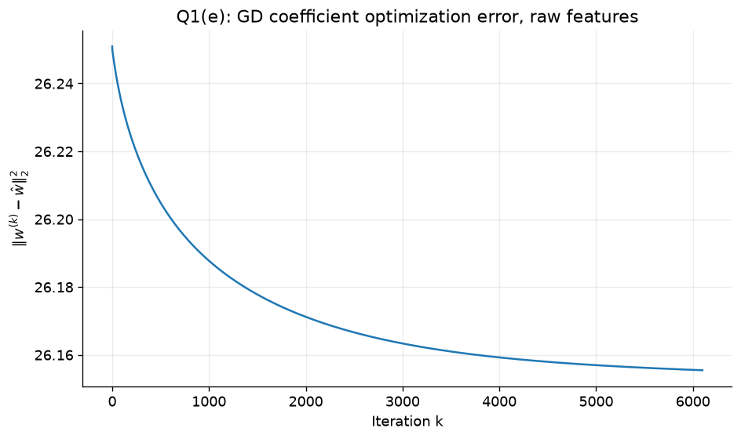
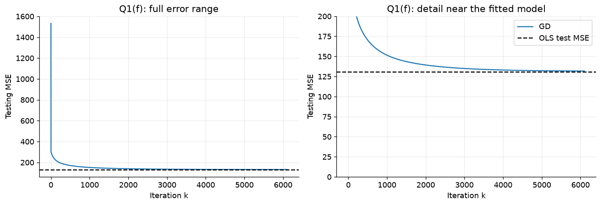
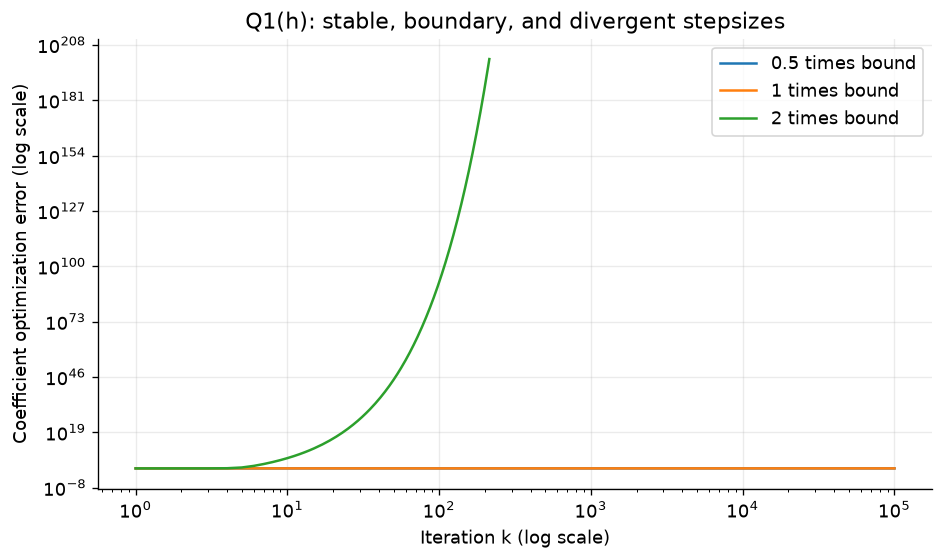
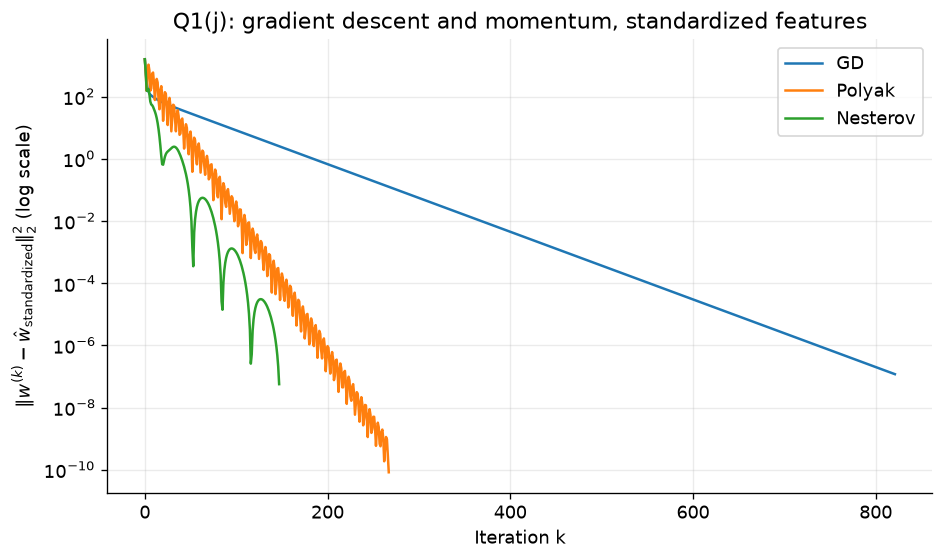
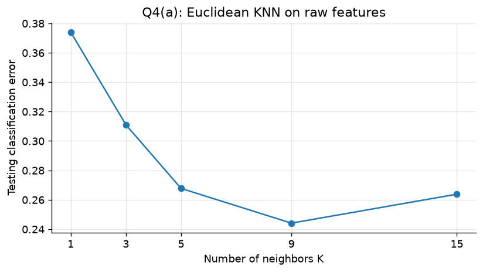
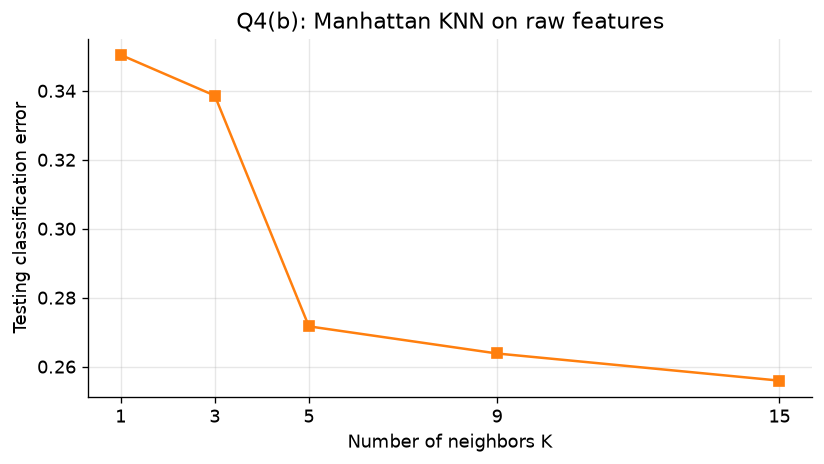
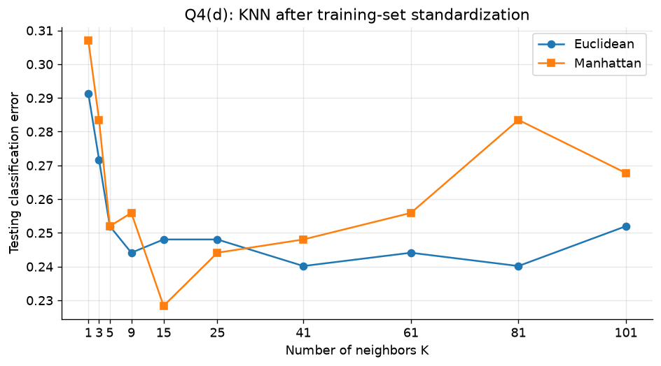
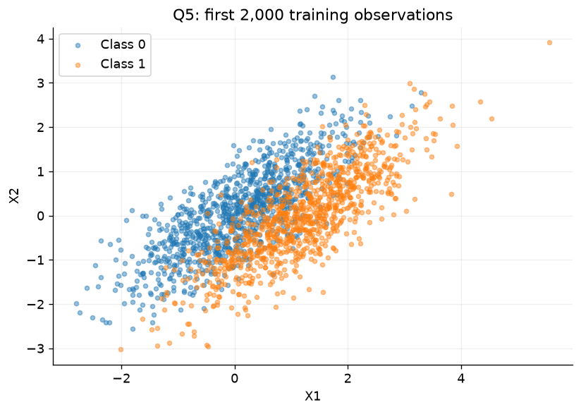
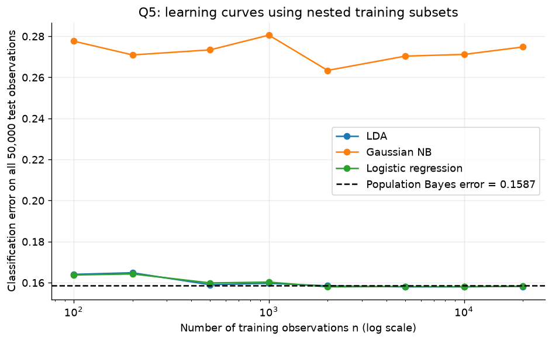

# ISYE 6740 · Homework 1

[](https://github.com/Guohuan-Feng/ISYE-6740-HW1/actions/workflows/verify.yml)

Regression, numerical optimization, robust estimation, classification, nearest neighbors, and Bayesian decision theory. The completed notebook contains the derivations, code, numerical results, and **all nine figures**, with **37 executed code cells**.

**中文入口：** [直接阅读完整报告](https://guohuan-feng.github.io/ISYE-6740-HW1/) · [查看下面的全部图表](#figure-gallery) · [打开作业 notebook](HW1_completed.ipynb) · [下载整个仓库](https://github.com/Guohuan-Feng/ISYE-6740-HW1/archive/refs/heads/main.zip)

| Start here | Contents |
| --- | --- |
| **[Read the report online](https://guohuan-feng.github.io/ISYE-6740-HW1/)** | Rendered answers, equations, tables, code, and plots; no Python installation needed |
| **[Completed notebook](HW1_completed.ipynb)** | The `.ipynb` file to review and upload to Canvas |
| [Figure gallery](#figure-gallery) | All nine plots displayed directly on this page |
| [Detailed results](docs/RESULTS.md) | Question-by-question results and interpretation |
| [Reproduction guide](docs/REPRODUCIBILITY.md) | Environment, fresh execution, and verification |
| [Dataset catalog](data/README.md) | Ten supplied train/test files and their schemas |
| [Versioned downloads](https://github.com/Guohuan-Feng/ISYE-6740-HW1/releases) | Submission notebook, complete archive, and SHA-256 checksums |

The root [HTML file](HW1_completed.html) is an offline reading copy: download it and open it in a browser. GitHub's file view displays HTML source; use the **online report** above for a rendered page.

## Assignment map

| Question | Topics | Included outputs |
| --- | --- | --- |
| Q1 | OLS, gradient descent, conditioning, Polyak and Nesterov acceleration | Coefficients, convergence derivations, MSEs, four plots |
| Q2 | OLS, penalized LAD, Huber regression | Coefficient and test-MSE comparisons, robustness discussion |
| Q3 | LDA, Gaussian naive Bayes, logistic regression | Test errors, odds ratios, parameter counts |
| Q4 | Euclidean and Manhattan KNN, standardization | K sweeps, training/test comparisons, three plots |
| Q5 | Gaussian classes, Bayes boundary and error, learning curves | Analytical derivation, scatter plot, learning curves |
| Q6 | Rare-event diagnosis, Bayes' rule, repeated tests | Exact probabilities, seeded simulation, decision-rule comparison |

## Selected results

| Experiment | Result |
| --- | --- |
| Q1 OLS | Training MSE **101.065094**; test MSE **130.571625** |
| Q1 standardized optimization | GD **821**, Polyak **267**, Nesterov **147** iterations to the same gradient tolerance |
| Q2 robust regression | LAD test MSE **137.739939**; OLS **173.657334**; Huber, ε = 1.35, **143.891748** |
| Q3 spam classification | Logistic **7.4416%**, LDA **9.9402%**, Gaussian NB **19.1744%** test error |
| Q4 standardized Manhattan KNN | Lowest error in the requested sweep: **22.8346%** at K = 15 |
| Q5 at 20,000 training observations | LDA **15.816%**, logistic **15.826%**, Gaussian NB **27.478%**; theoretical Bayes error **15.8655%** |
| Q6 diagnosis | P(disease ∣ positive) = **9.0164%** under the specified prevalence and test accuracy |

These are results on the supplied assignment splits. Minima in test-error sweeps are descriptive comparisons, not estimates from a separate hyperparameter-validation procedure. Q1's raw-feature update stopping criterion also differs from its later gradient criterion; the notebook explains why a small update need not imply convergence of the coefficients. See [detailed results](docs/RESULTS.md).

## Figure gallery

Each image is exported directly from the saved notebook output. Click a plot to open the full-size PNG. The [figure index](figures/README.md) also lists individual files.

### Q1 · Optimization

**Q1(e) — Squared coefficient error during gradient descent.** Raw feature scales produce slow convergence in low-curvature directions.



**Q1(f) — Test MSE along the gradient-descent path.** The horizontal reference is the OLS test MSE.



**Q1(h) — Stepsizes relative to the stability bound.** The strict convergence condition is 0 < η < 2/λmax(H); equality can oscillate and exceeding it can diverge.



**Q1(j) — Standardized GD, Polyak, and Nesterov.** All three methods use the same gradient stopping tolerance.



### Q4 · Nearest neighbors

**Q4(a) — Euclidean distance on the original feature scales.**



**Q4(b) — Manhattan distance on the original feature scales.**



**Q4(d) — KNN after standardization.** Scaling uses training-set means and standard deviations for both train and test observations.



### Q5 · Classification and Bayes error

**Q5(a) — First 2,000 training observations, colored by class.** Correlated Gaussian features motivate the comparison with the conditional-independence assumption. The Bayes boundary is derived in Q5(b) of the notebook.



**Q5(c) — Learning curves against the Bayes error.** The test set is fixed as the training subset grows.



## Reproduce and verify

Use **Python 3.12**. Run from the repository root after activating a virtual environment:

```bash
python -m pip install -r requirements.txt
python scripts/verify.py
python scripts/verify.py --execute
```

The first check validates the saved notebook, its outputs, the image gallery, and dataset integrity. `--execute` also reruns all cells in a fresh kernel and writes a new notebook, HTML report, and verification record to `build/`. The checked-in submission notebook remains unchanged. Full installation instructions and reproducibility limits are in the [reproduction guide](docs/REPRODUCIBILITY.md).

To regenerate the gallery and reading copies from the checked-in notebook outputs:

```bash
python scripts/export_assets.py
```

The [verification workflow](.github/workflows/verify.yml) runs on pushes and pull requests and can be started manually in Actions. It executes the notebook with the pinned dependencies.

## Repository layout

```text
ISYE-6740-HW1/
├── HW1_completed.ipynb       # Complete assignment and saved outputs
├── HW1_completed.html        # Downloadable offline report
├── README.md                # Navigation, results, and all nine figures
├── requirements.txt         # Tested package versions
├── data/                    # Ten original train/test datasets
│   ├── README.md            # Dataset schema and provenance
│   └── manifest.json        # File sizes and SHA-256 checksums
├── figures/                 # Nine PNGs extracted from the notebook
├── docs/
│   ├── index.html           # Rendered report served by GitHub Pages
│   ├── RESULTS.md           # Detailed numerical findings
│   └── REPRODUCIBILITY.md    # Setup, checks, and limitations
├── scripts/
│   ├── verify.py            # Saved-output checks and fresh execution
│   └── export_assets.py     # Rebuild gallery and HTML from saved outputs
└── .github/workflows/
    └── verify.yml           # Automated execution and integrity checks
```

## Submission

Review **[HW1_completed.ipynb](HW1_completed.ipynb)** and upload that file to Canvas. Its outputs are embedded, including every chart; GitHub publication does not submit the assignment to Canvas. Add a teammate name in the notebook only if applicable. For local reruns, retain the `data/` directory alongside the notebook.

## Source and attribution

The assignment prompts and datasets come from the user-supplied ISYE 6740 `HW1.zip`. The notebook records the completed analysis. No additional license is asserted over the course material or supplied datasets. See [data/README.md](data/README.md) and [data/manifest.json](data/manifest.json).
